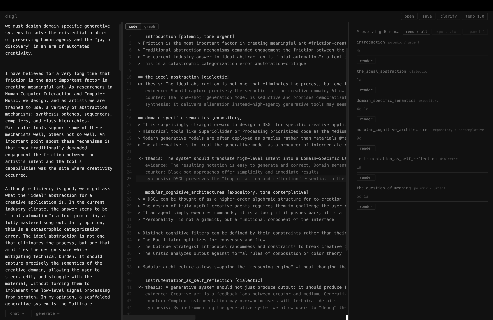
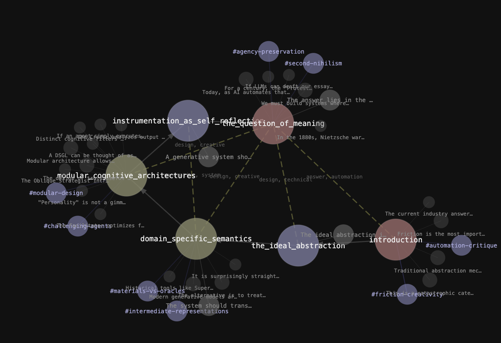

# Theo

Theo is a thinking tool for writers. You describe *what* you want to say, and Theo helps you see how it could be organized before any prose is generated.

You work in `.theo` files, a plain-text format for specifying the structure of an essay: sections, claims, arguments, figures, and references. Theo can suggest potential structures from rough notes, or you can build one yourself. Either way, you see the shape of your argument laid out explicitly, and you decide what stays, what moves, and what gets cut. Once the structure feels right, the system renders each section into prose using Claude.

The notation captures the semantics of academic writing (rhetoric modes, claim strengths, argument structure, cross-references) so you can reason about your essay at the level of ideas rather than sentences. This preserves the loop of action and reflection that is essential to the act of writing.

The system also includes cognitive agents (a Critic, an Oblique Strategist, and a Facilitator) that review rendered prose and return structured feedback. These agents never rewrite your text. They analyze, challenge, and provoke, leaving the creative decisions to you.

## Theo Studio



*Three-panel layout: freeform input (left), `.theo` editor with syntax highlighting (center), and rendered prose view (right).*



*Graph view: a D3 force-directed graph showing the structural relationships between sections, claims, and arguments.*

## Prerequisites

- **Python 3.10+**
- **Node.js 18+** (only needed for Theo Studio)
- An **Anthropic API key** (get one at [console.anthropic.com](https://console.anthropic.com))

## Setup

### 1. Clone and install Python dependencies

```bash
git clone <repo-url>
cd Theo
pip install -r requirements.txt
```

The only Python dependency is the `anthropic` SDK.

### 2. Set your API key

Theo uses the Anthropic Python SDK, which reads the key from the `ANTHROPIC_API_KEY` environment variable.

```bash
export ANTHROPIC_API_KEY="sk-ant-..."
```

To make this persistent, add the line above to your shell profile (`~/.zshrc`, `~/.bashrc`, etc.) and restart your terminal.

### 3. Verify the setup

You can inspect the example essay's structure without making any API calls:

```bash
python example_paper.py
```

This parses `example_paper.theo` and prints the structural tree (sections, claims, arguments, figures, and references).

To render the essay into prose (requires a valid API key):

```bash
python example_paper.py --render
```

To also run the cognitive agents for feedback:

```bash
python example_paper.py --render --agents
```

To write the output to a specific file:

```bash
python example_paper.py --render -o my_essay.txt
```

## Theo Studio (Desktop App)

Theo Studio is a three-panel desktop editor built with Electron, React, and Vite. It provides a freeform input panel, a CodeMirror editor with `.theo` syntax highlighting, and a prose rendering view.

### Install and run

```bash
cd studio
npm install
npm run dev
```

This starts the Vite dev server, spawns the FastAPI Python backend on port 8420, and opens the Electron window. The backend requires the same `ANTHROPIC_API_KEY` environment variable.

To run the backend separately:

```bash
cd studio
npm run backend
```

### Studio features

- **Freeform-to-structure**: paste rough notes or prose into the left panel and Theo will suggest potential structures as `.theo` skeletons that you can edit and rearrange
- **Pre-generation clarification**: the system asks you targeted questions before generating structure, helping you discover what you actually want to argue
- **Section-by-section rendering**: render individual sections or all at once, with adjustable temperature
- **Clarify mode**: before rendering a section, get clarification questions to refine the output
- **Drag-to-reorder sections** in the prose panel
- **Editable rendered prose**: directly edit the generated text
- **Open/save `.theo` files** via native file dialogs
- **Export** rendered essay as plain text

## `.theo` Format Reference

```
# Title
@ Author

ref KEY: Authors, "Title", Venue, Year

== section_name [rhetoric_mode]
== section_name [rhetoric_mode, tone=X]

> claim text
> claim text (suggest)
> claim text (assert) #tag-name
> claim text (question)

>> thesis: The main argument
   evidence: item1, item2, item3
   counter: The opposing view
   synthesis: The resolution

~~ figure_name (lang) "caption"
``` ```
code here
``` ```
```

**Rhetoric modes**: `dialectic` (thesis/counter/synthesis), `polemic` (forceful advocacy), `expository` (clear explanation), `compressed` (dense, minimal).

**Claim strengths**: `assert` (default, stated as fact), `suggest` (tentative), `question` (posed as a question).

**Tags**: `#tag-name` on claims creates cross-references between sections.

**Tone**: optional `tone=X` parameter on sections (e.g., `urgent`, `measured`, `contemplative`).

## Using Theo as a Library

```python
import theo

# Load and inspect
paper = theo.load("my_essay.theo")
paper.inspect()

# Render all sections
rendered = paper.render(output="output.txt")

# Render with agent feedback
agents = [theo.Critic(), theo.ObliqueStrategist(), theo.Facilitator()]
rendered = paper.render(agents=agents, output="output.txt")

# View feedback
paper.show_feedback()
paper.show_feedback(agent_name="Critic")
```
